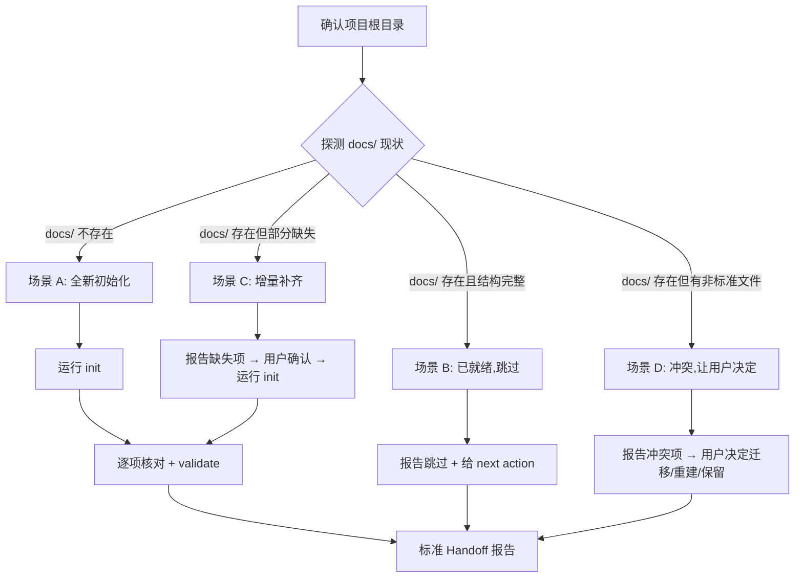

# Init

## Overview

为目标项目创建 Project Kit 标准 `docs/` 目录结构。初始化之后,后续 10 个技能(brief / blueprint / roadmap / plan / execute-plan / verify-plan / change / bug / status / constitution)有统一的落盘与读取位置。

## The Iron Law

```
SCRIPT CREATES — AI DETECTS, ROUTES, AND VERIFIES
```

**Violating the letter of this rule is violating the spirit of initialization discipline.** AI 禁止手建目录或根文档。脚本是唯一事实源——AI 手工建的目录/文件无法保证与模板一致,后续 `validate` 必报错。

## Process



### Step 1: 确认目标项目根目录

检查目标目录:有 `.git` → 确认;无 `.git` → 声明"未检测到 .git,将 `<路径>` 作为项目根",让用户确认后再继续。不猜。

### Step 2: 探测 docs/ 现状

```bash
node scripts/project-docs.cjs status --root <项目根>
```

同时直接检查文件系统:

```bash
test -d <项目根>/docs && find <项目根>/docs -maxdepth 1 | sort || echo "docs/ 不存在"
```

根据结果路由到四个场景之一。

### Step 3-6: 按场景执行

#### 场景 A — 全新初始化(docs/ 不存在)

直接运行:

```bash
node scripts/project-docs.cjs init --root <项目根>
```

期望输出:4 个根文档全部显示"创建:",3 个受管子目录静默创建。没有任何"跳过已有文件"提示。

进入 Step 7(核对与校验)。

#### 场景 B — 已就绪(docs/ 存在且结构完整)

条件:4 个根文档全部存在 + `validate` 0 错误 + 无模板变量残留 + 无非标准文件。

**不运行 init。** 直接报告"项目文档结构已就绪",跳到 Handoff。

#### 场景 C — 增量补齐(docs/ 存在但缺失部分)

条件:部分根文档缺失,**没有**非标准文件(冲突)。

先报告缺失项清单:

```text
缺失根文档: <列出>
已有文件(不会被覆盖): <列出>
```

获得用户确认后运行 init。确认输出中对应的缺失项显示"创建:",已有项显示"跳过已有文件"。进入 Step 7。

#### 场景 D — 结构冲突(docs/ 存在且有非标准文件)

条件:docs/ 里存在目录契约之外的 `.md` / `.txt` 等文件。

**不运行 init。** 列出冲突项并让用户选择处理方式:

| 选项 | 做什么 | 适用场景 |
|---|---|---|
| **A: 迁移** | 内容并入标准结构(如归档到 `research/`),删除原文件,然后 init | 文件有保留价值 |
| **B: 重建** | 删除非标准文件,然后 init | 文件是临时笔记,可丢弃 |
| **C: 保留** | 不 init,保留现状 | 用户不想改变现有结构 |

收到决策后执行对应操作。选择 A/B 后运行 init 并进入 Step 7;选择 C 直接跳到 Handoff(Blocked)。

### Step 7: 核对与校验(场景 A / C / 决策后的 D)

#### 核对清单

- [ ] 3 个根文档:`constitution.md`、`blueprint.md`、`roadmap.md`
- [ ] 本地私有目录 `.project-kit/state.md` 已创建,仓库根 `.gitignore` 含 `.project-kit/`
- [ ] 3 个受管子目录:`briefs/` `changes/` `research/`
- [ ] 无模板变量残留:`grep -r "{{" docs/` 期望空输出
- [ ] 根文档 frontmatter 无占位符(如 `{{DATE}}` 替换为实际日期)

#### 脚本校验

```bash
node scripts/project-docs.cjs validate --root <项目根>
```

期望:输出含"错误: 0"。

**有任何一项不满足 → 修复后重跑。不把"已知问题"带进下游。**

### Step 8: 标准 Handoff

#### 场景 A/C(成功)的报告

```
已初始化: <项目根>/docs/
- 根文档(3): constitution / blueprint / roadmap
- 子目录(3): briefs / changes / research
- 本地私有: .project-kit/state.md(个人状态,gitignored 不提交)
- validate: 0 错误
下一步: constitution(制定准则) 或 brief(接收需求)
```

#### 场景 B(跳过)的报告

```
项目文档结构已就绪,无需重新初始化。
- validate: 0 错误
- 下一步: 根据当前阶段选择技能。运行 status 查看当前焦点。
```

#### 场景 D(冲突)的报告

```
docs/ 存在非标准文件,需要决定如何处理:
- <文件1>: <说明>
- <文件2>: <说明>
选项: A 迁移 / B 重建 / C 保留现状
```

收到决策后按场景 D 的处理方式继续。

## 目录契约(后续所有技能的读取约定)

init 产出的结构,也是后续 10 个技能的读写契约:

```text
<项目根>/docs/
├── constitution.md      # 稳定准则 → plan/execute/verify 的约束来源
├── blueprint.md         # 系统边界 → brief/change 读写
├── roadmap.md           # 阶段分组 + 焦点 → status 读写
├── briefs/              # BRIEF-###-<slug>.md(原始讨论存档)
├── changes/             # CR-###-<slug>/{proposal,spec,plan}.md(Full 变更三件套)
├── research/            # 自由研究材料
└── (capabilities/ 保留兼容,不预建)

<项目根>/.project-kit/   # 本地私有(不入库):当前本地人员状态
└── state.md             # 当前焦点(active_change)→ 个人接力的首要入口
```

**Quick 变更不落盘**——记录 = git commit + 本地 state 一行。只有 Full 变更才在 `changes/` 下创建目录。

## Exception Handling

- **`init` 命令报错**:报告完整错误信息,不绕过。检查:脚本文件是否存在(`scripts/project-docs.cjs`)、Node 版本是否 ≥18、目标目录权限。
- **`validate` 报"未替换模板变量"**:`grep -r "{{" docs/` 定位,手动替换后重跑。若反复出现,检查模板文件(`assets/templates/`)是否被损坏。
- **`validate` 报"缺少根文档"**:检查文件名是否精确匹配(大小写、下划线 vs 连字符)。
- **`status` 命令不可用**:脚本文件缺失或损坏 → 直接检查文件系统作为降级方案,同时报告脚本异常。
- **用户中途改变项目根目录**:已生成内容保留在原位置,在新位置重新执行完整流程。

## Common Rationalizations

| 借口 | 现实 |
| --- | --- |
| "手工建几个目录更快" | AI 手建的文件名/frontmatter 与模板不一致,validate 必报错,下游技能读取失败 |
| "直接 mkdir 就行,不用跑脚本" | 脚本渲染模板、写入 frontmatter、分配日期——这些步骤手工做不到一致 |
| "docs 差不多有了,不用 init" | 缺少任一受管目录,对应文档类型无法落盘,追踪链断裂 |
| "文件已存在就不会有问题" | 已存在但文件名或 frontmatter 不符约定的文件,下游技能静默忽略 |
| "validate 报错先继续,后面再修" | 结构错误会传染到所有后续技能,必须在本技能内清零 |
